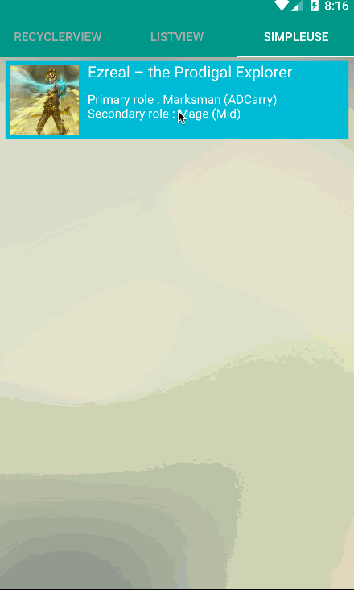
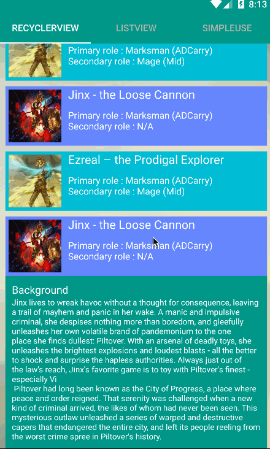
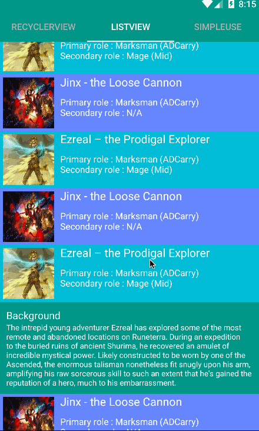

# ExpandableLayout

A expandable Layout to save space and  reduce jump between Activity and Fragment
####[](https://jitpack.io/#SilenceDut/ExpandableLayout)

**_SimpleUse_**



**Use in RecyclerView**

parent view  scroll automatically if the view expand  out of device screen
(当展开时如果超过屏幕的高度是父控件自动上移)



**Use in listView**

parent view  not scroll automatically if the view expand  out of device screen
(当展开时如果超过屏幕的高度是父控件不自动上移)



####[sample.apk](https://github.com/SilenceDut/DayNightToggleButton/blob/master/apk/expandable.apk?raw=true) 
(It runs smoothly, but gif is not appear well)
Adding to your project
----------------------
This library is available through JitPack.

Step 1. Add the JitPack repository to your build file

**gradle**
```groovy
allprojects {
    repositories {
        ...
        maven { url "https://jitpack.io" }
    }
}
```
**maven**
```xml
<repositories>
    <repository>
        <id>jitpack.io</id>
        <url>https://jitpack.io</url>
    </repository>
</repositories>
```

Step 2. Add the dependency

**gradle**

```groovy
compile 'com.github.SilenceDut:ExpandableLayout:{latest-version}'
```
**maven**

```xml
<dependency>
    <groupId>com.github.SilenceDut</groupId>
    <artifactId>ExpandableLayout</artifactId>
    <version>{latest-version}</version>
</dependency>
```
Basic Usage
-----------
**Supported Attributes**

|           attr        	|     default      |                         mean                          	 |
|:------------------------- |:---------------- |:------------------------------------------------------- |
| expDuration      	| 300            | expand duration.  |
| expWithParentScroll   | false  | parent view should scroll automatically if the view expand  out of device screen（当展开时如果超过屏幕的高度是父控件否自动上移).   |
| expExpandScrollTogether| false          | parent view should scroll together with view expanding. |
**ExpandableLayout inherited from LinearLayout,and the default setOrientation is **VERTICAL****

```xml
<com.silencedut.expandablelayout.ExpandableLayout
    xmlns:android="http://schemas.android.com/apk/res/android"
    xmlns:app="http://schemas.android.com/apk/res-auto"
    app:expWithParentScroll="true"
    app:expDuration = "300"
    app:expExpandScrollTogether = "false"
    android:layout_width="match_parent"
    android:layout_height="wrap_content">

    <layout1
    ...
    />
    
    <layout2
    ...
    />

</com.silencedut.expandablelayout.ExpandableLayout>
```


License
-------

    Copyright 2015-2016 SilenceDut

    Licensed under the Apache License, Version 2.0 (the "License");
    you may not use this file except in compliance with the License.
    You may obtain a copy of the License at

       http://www.apache.org/licenses/LICENSE-2.0

    Unless required by applicable law or agreed to in writing, software
    distributed under the License is distributed on an "AS IS" BASIS,
    WITHOUT WARRANTIES OR CONDITIONS OF ANY KIND, either express or implied.
    See the License for the specific language governing permissions and
    limitations under the License.